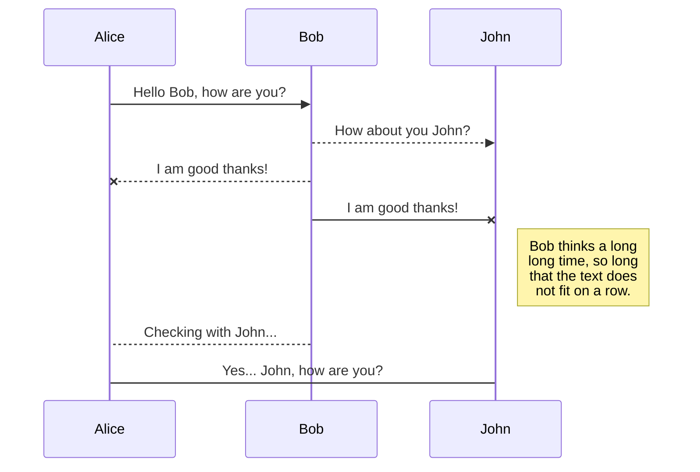
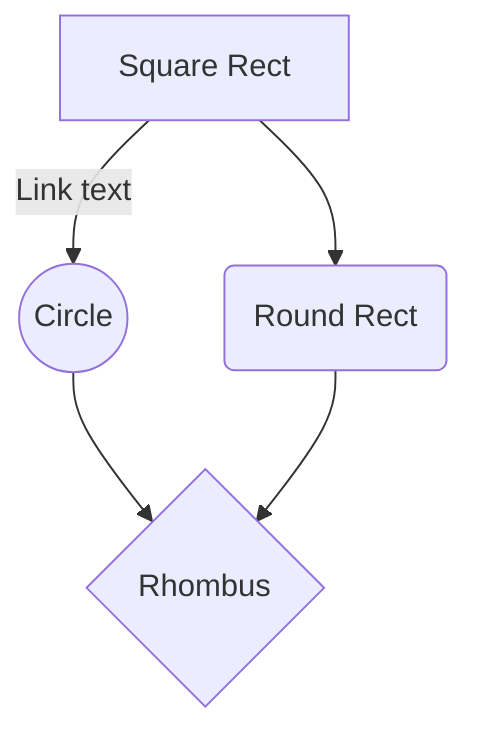

20181025 教育内容

## VSCode

## 変更とリポジトリアップロード

## 俺様コマンドの準備

 -

## フローチャート

### StackEdit

- URL https://stackedit.io/app

- 設定項目（`sequenceDiagram`）
    - 直線　　： `->`
    - 点線　　： `-->`
    - 直線矢印： `->>`
    - 点線矢印： `-->>`
    - 直線NG線： `-x`
    - 点線NG線： `--x`
    - メモ： `note right of <ID>: <コメント>`

- 設定項目（`graph TD`）
    - 四角： `<ID>[<TEXT>]`
    - 丸　： `<ID>((<TEXT>))`
    - 角丸： `<ID>(<TEXT>)`
    - 菱形： `<ID>{<TEXT>}`
    - 線内メモ：　`-- <TEXT> --`
    - 線は sequenceDiagram と同じ

- サンプル

