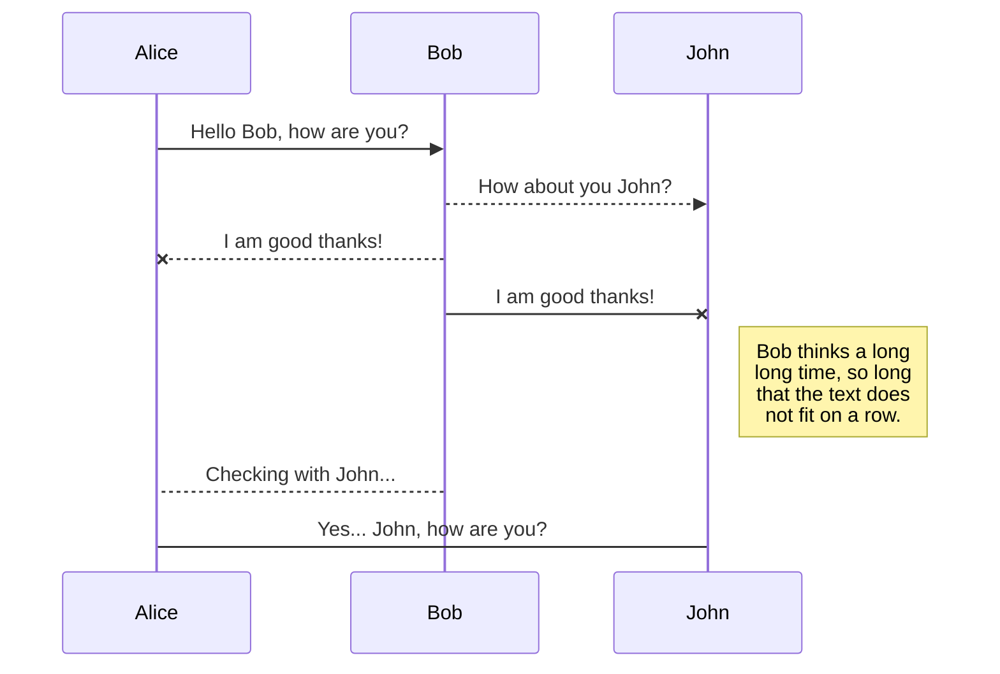
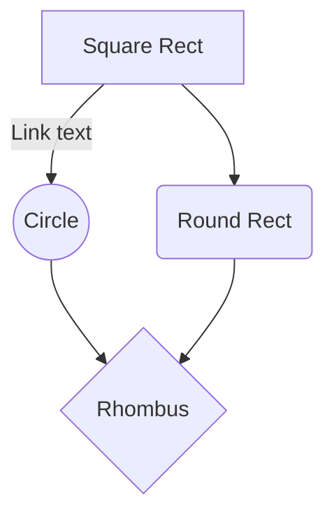

20181025 教育内容（予定）

10:00-18:30

## 開発環境の整備

### Train用リポジトリの作成

## Rickty Diminished Discrod

	* 
メリット

		* 
全角スペースが可視化される（インデントのミス発見につながる）

## Linter

	* 
コーディング規約に準拠するようにチェック、校正をかけてくれるもの
	* 
Python のコーディング規約は基本 PEP-8 で定義されている
	* 

## 手癖として付けたいステップ

	1. 
コード入力
	2. 
Linter の実行→保存
	3. 
コードの実行→動作確認→ 1 へ

## API

	* 
Application Programming Interface
	* 
アプリに限らず利用するための仕様や仕組み

		* 
Web API
		* 
Windows API
		* 
コマンドの引数
	* 
アプリ間をつなぐもの（アプリを骨とすると軟骨の部分全般）

		* 
MyApp → Windows (95, 7, Me, XP, 10) → 全部のOSの仕様に追随するのはたいへん

			* 
MyApp → Windows API → Windows 95
			* 
MyApp → Windows API → Windows 7
			* 
MyApp → Windows API → Windows Me
			* 
MyApp → Windows API → Windows 10
			* 
MyApp → ThirdPartyAPI → Windows 10
		* 
印刷例

			* 
R-App → ドライバ → Windows API → スプーラー → I/O → プリンタ 
		* 
train_Muscle API

			* 
$ train 前側 20181025

				* 
arg1 -> 前側
				* 
arg2 → 20181025
	* 
疑問

		* 
『アプリ「A」に対して●●●をしたいがどうやってデータを渡していいかわからない』
		* 
解決法：アプリ「A」の仕様を知る必要がある and/or 受け口を設けないといけない

			* 
仕様および受け口を API と呼ぶ
			* 

## インターフェース

	* 
Data : Input / Output （I/O）
	* 
Action: Request / Response

		* 
Line Server (request to Lamplus Server) →``http://lamplus.com/?user=xxxxx&value=53&token=xxxxxxx&hogehoge=xxxx`

			* 
user -> xxxx
			* 
value -> 53
			* 
etc...
		* 
Lamplus Server (response to Line Server） → "msg("平均値オーバーです")"
	* 
パラメーター

		* 
URL の場合クエリの内容

			* 
リクエスト URL をエンドポイントと呼ぶ
			* 
`http://lamplus.com` → エンドポイント
			* 
`/?user=xxxx&hoge=xxxx...` →パラメーター and/or クエリ
		* 
コマンドの場合は引数の内容

			* 
$ train →エンドポイント
			* 
「前側 20181025」→パラメーター

	* 
cURL コマンドは Web サーバーに request して response を取得するコマンド

## SDK

	* 
Software Development Kit ソフトウェア開発キット
	* 
「A」というアプリに関するソフト（拡張機能やプラグインなど）を開発する際に「A」のメーカーが提供するもの

		* 
メリット：「A」アプリの利便性が高まる
	* 
理由

		* 
API を自身で網羅するのたいへんなので、使いやすくしたキットを提供→SDK
	* 
有名どころ

		* 
Java SDK など

## API と DLL の違い（Windows の場合）

	* 
API は上記参照
	* 
DLL

		* 
exe と同じもの（ユーザーが実行できるバイナリ（コンパイル済み）ファイル）
		* 
dll はプログラムから呼び出されるもの（アプリが実行できるバイナリファイル）
		* 
必要な時に呼び出す実行ファイル（要引数）
	* 
Ridoc

		* 
本体起動時に PDF/OCR 機能 etc も一緒に読み込むと重い（exe のサイズが大きくなる。スタティック）

			* 
解決策：PDF/OCR 変換時に呼び出す（ダイナミック）

## ライブラリ

特定目的や作業において使いやすくしたもの。（コレクションからの選抜集みたいなもの）

	* 
データなどの保管庫
	* 
コレクション、アーカイブ、ライブラリの違い
いずれも（１ヶ所に） 保管している

		* 
コレクション

			* 
主旨：（特定のなにかを）集める「こと」（行為）に重きを置いたもの

				* 
使用／利用頻度が低いものも大事（レアもの）
		* 
アーカイブ

			* 
主旨：集める「場所」に重きを置いたもの（とりまとめ）
		* 
ライブラリ

			* 
主旨：「使うこと」に重きを置いたもの

				* 
使いたい時にすぐ使えない、出てこないといけない
	* 
整理と整頓の違い
組織における大事なこと

		* 
整理

			* 
用途、目的別に分類
			* 
検索しやすい（どこになにがあるか把握している）状態
			* 
机上が汚いがすぐに目的のものを取り出せる

				* 
頭のメモリに場所が記憶されている → 本人は早いが他人は探しづらい
			* 
使う人（特定多数or 少数）のために必要なもの（利用者に最適化したもの）

				* 
探すのに時間がかかてはいけないもの
			* 
図書館の場合

				* 
図書カード（x番棚のy段目）で検索 → ランダム・アクセス
		* 
整頓

			* 
綺麗に並べる、見た目よく並べる
			* 
取り出しやすく
			* 
ソートされた状態（あいうえお順、大きさ順、ジャンル別）
			* 
机上が綺麗だが目的のものが探さないと取り出せない

				* 
頭のメモリに場所が記憶されていない → 遅い（時間がかかる）が他人は探しやすい
			* 
不特定多数の人のために必要なもの

				* 
時間はかかるがなめていけば見つかる状態
			* 
図書館の場合

				* 
本棚を見ながら検索 → シーケンシャル・アクセス

		* 
ランダム・アクセスとシーケンシャル・アクセス

			* 
ランダム・アクセス（Randum）

				* 
USB/SSD/メモリ
				* 
どこに何があるかのマップがわかっている
				* 
n 曲目を聞きたい

					* 
レコードの針を動かして再生するような（早送り、巻き戻しがない）状態
					* 
iPod で曲を選択 → メモリにアクセスするイメージ
					* 
ヘッダの移動がない
				* 
机上が汚いがすぐに目的のものを取り出せる
			* 
シーケンシャル・アクセス（Sequence）

				* 
HDD/カセットテープ
				* 
どこに何があるかサーチしないといけない
				* 
n 曲目を聞きたい 

					* 
データがレコードのような状態（早送り、巻き戻し）
					* 
ヘッダの移動が必要
				* 
机上が綺麗だが目的のものが探さないと取り出せない
	* 
ライブラリに必要なもの

		* 
取捨選択/断捨離 → 目的のために鋭くするようなイメージ
		* 
たくさんある本（コレクション） の中から 「パソコン関係の本のみ」を選抜 → ライブラリ
	* 
俺様ライブラリを作ろう（GitHub にアップしておこう）

		* 
出先、出向先でも探せる／アクセスできるか
		* 
よく使うもの

			* 
tips やスニペットなど
		* 
自作関数をまとめたもの（俺様 API）

			* 
Web API を取得する関数
			* 
JSON ファイルを読み込み、保存する関数
		* 
メリット

			* 
サポートは自分が飽きるまで
			* 
下位互換（古いバージョンのアプリでも使える）対応
		* 
デメリット

			* 
作りきるのが大変
			* 
メンテ／サポートは自分
	* 
ゼロから作るのは大変な場合

		* 
フレームワークを使う（先人たちのライブラリ）
ライブラリを元にアプリの基礎構築（骨組み作成）をしやすいシステム

			* 
デメリット：

				* 
フレームワークの API （仕様）を勉強しないといけない
				* 
ライセンスの問題など
				* 
フレームワークのサポートが終わったら徐々に使えなくなる
			* 
メリット

				* 
開発が速い
				* 
車輪の再発明防止（時間の節約）
	* 
CSVとJSONの違い（もしくはYAML）

		* 
基本仕様

			* 
どちらもテキスト・データ
			* 
row → 行のこと
			* 
column →列のこと
		* 
CSV

			* 
テキスト形式のカンマ区切データのフォーマット

				* 
row → １行（改行コード）
				* 
column → カンマ間が１列（列名は初行で定義）

<cell name1>, <cell name2>
<cell 1 data>, <cell 2 data>

	* 
JSON

		* 
元々は Javascript 用のデータフォマットとして生まれた
		* 
テキスト形式のカッコ区切りのデータのフォーマット

			* 
row → []
			* 
column →{} →このなかにカンマ間が１列（列名付き）

[
    {
        <cell 1>:<cell 1 data A>,
        <cell 2>:<cell 2 data A>
    }
    {
        <cell 2>:<cell 2 data B>
        <cell 1>:<cell 1 data B>,
    }
]

	* 
YAML

		* 
これもテキスト形式のインデントによるデータ・フォーマット
		* 
"xxx.ini" っぽい書式
		* 
主に設定系のファイルに使われる

## 改行コード（EOL = EndOfLine の種類）

	* 
OS によって改行コードは異なる
CR = キャリッジ・リターン (ASCIIコード 0x0d)
LF = ライン・フィード (ASCIIコード 0x0a)

		* 
Windows

			* 
CR/LF
		* 
Linux/Unix/macOS

			* 
LF
		* 
漢字Talk(旧MacOS）

			* 
CR
	* 
プログラム上で表現する場合

		* 
CR を
	* 
ポイント

	1. 
改行コードは所属団体・組織のルールにあわせる
	2. 
バイナリ・ビューアで確認すること（CRが入っていないかなど）

	* 
基本的にアプリ開発の場合は LF only が無難（Winユーザーの環境の場合は注意）

### StackEdit

	* 
URL https://stackedit.io/app

- 設定項目（`sequenceDiagram`）シーケンシャル図/シークエンス図
    - 直線　　： `->`
    - 点線　　： `-->`
    - 直線矢印： `->>`
    - 点線矢印： `-->>`
    - 直線NG線： `-x`
    - 点線NG線： `--x`
    - メモ： `note` 例）`note right of <ID>: <コメント>`

- 設定項目（`graph TD`）フロー図
    - 四角： `<ID>[<TEXT>]`
    - 丸　： `<ID>((<TEXT>))`
    - 角丸： `<ID>(<TEXT>)`
    - 菱形： `<ID>{<TEXT>}`
    - 線内メモ：　`-- <TEXT> --`
    - 線は sequenceDiagram と同じ

- サンプル

## 本や教科書の選び方
	1. 
ステップ・バイ・ステップで教えてくれるもの（教科書的なもの）
	2. 
How to もの（逆引き辞書や、なんとか100選的なもの）
	3. 
辞書として使えるもの

## 課題

	* 
Python の実行ファイル作成
	* 
引数からの受け取り
	* 
余力があったら：標準入力

		* 
input
	* 
標準出力
	* 
ファイルの読み込み （テキストデータ）
	* 
ファイルの書き込み （テキストの保存）
	* 
JSON データ(文字列）の取り扱い（JSON ->リスト（配列）にするには）
	* 
配列（リスト）を JSON 文字列（JSONデータ）にするには
	* 

