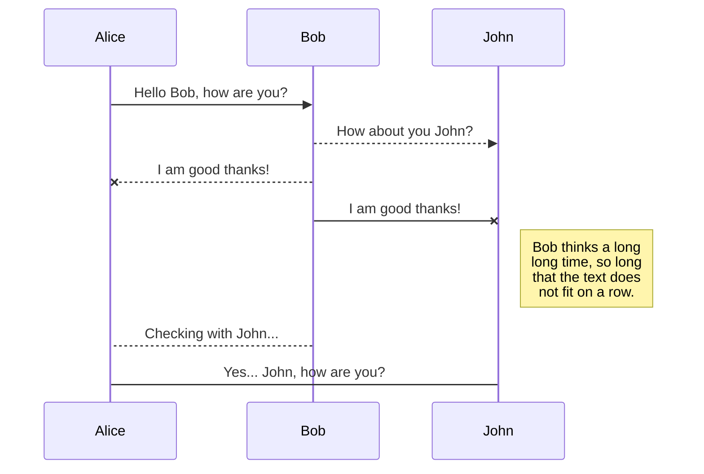
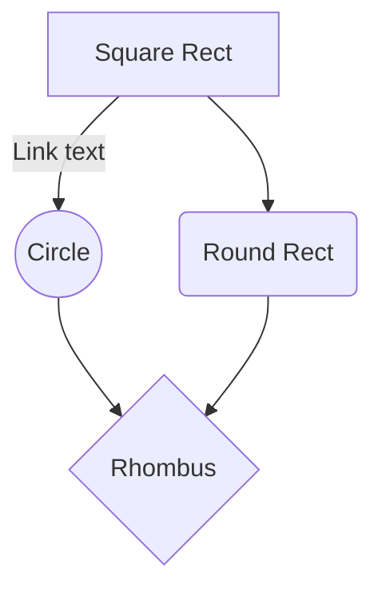

20181023 教育内容（予定）

14:00 - 

## 復習

- 2進数  バイナリ `0b`
- 8進数  オクト  `0o` or `0`
- 10進数 デカ    `0d`
- 16進数 ヘキサ  `0h`

## バイナリの確認

- `od -Ax -tx1z <name file>`
- `$ hexdump -C <name file>`
- UTF-8 BOM付きと UTF-8 BOMなしの違い
	- Windowsのメモ帳で新規作成と `vi` で作成したファイルの違い
- 

## フローチャート

- StackEdit
	- https://stackedit.io/app

## 次回課題

### インストール

- 開発用のフォント
	- Ricty Diminished と Ricty Diminished Discord

- VS Code（Visual Studio Code）
	- 標準フォントの設定 → Ricty Diminished